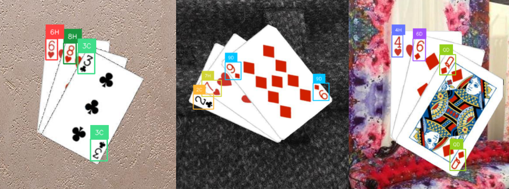
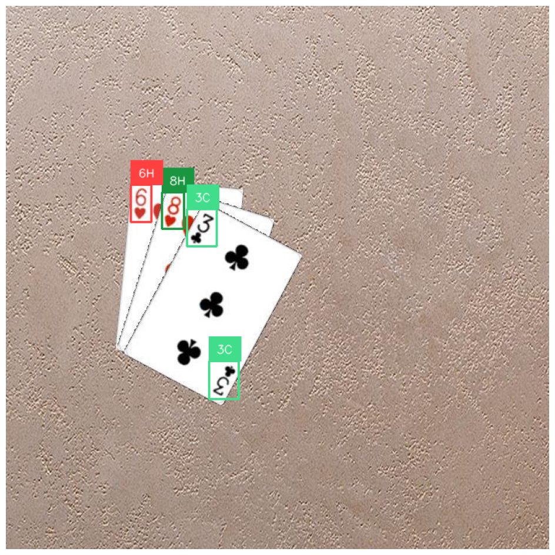
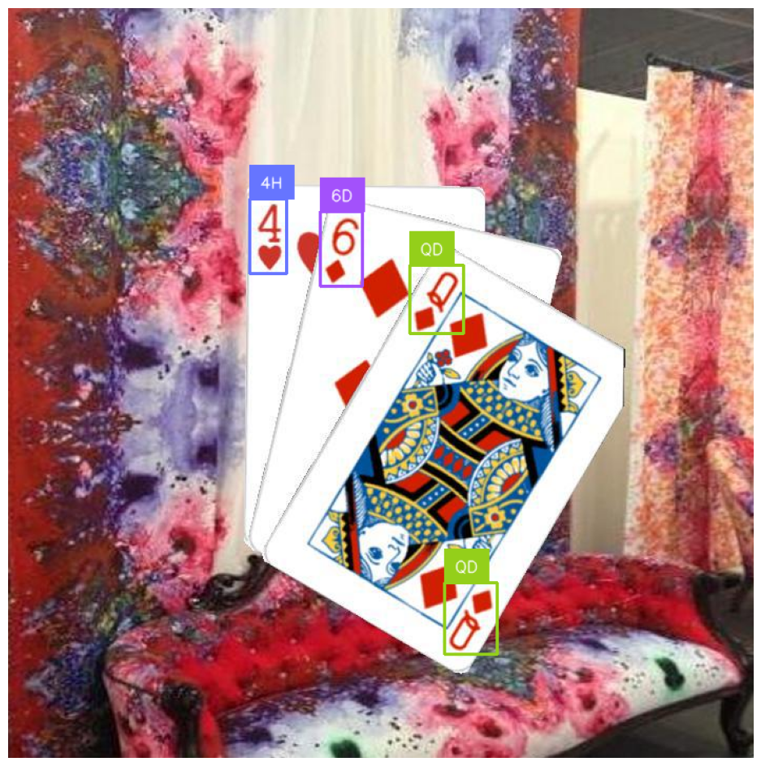

# Poker Hand Detection using YOLO11

One liner introduction to Poker Hand Detection using YOLO11 Project. features and etc.

## 1. Poker Hand Detection using YOLO11


I used a playing cards dataset from [Roboflow](https://universe.roboflow.com/augmented-startups/playing-cards-ow27d/dataset/4) and trained a YOLO11 model to detect poker hands.
I use this model to detect the cards on the table and on the player's hand.
The code for fine-tuning the model is available in the [Poker_Hand_Detection_YOLO11.ipynb](Poker_Hand_Detection_YOLO11.ipynb) notebook.
The code for doing inference and plotting the results is available in the [Poker_Hand_Inference.ipynb](Poker_Hand_Inference.ipynb) notebook.

*Trained for 30 epochs in 3.78 hours on google colab's T4 GPU.*



### Training Results

- Metrics

    | Class | Images | Instances | Box(P) | R    | mAP50 | mAP50-95 |
    |-------|--------|-----------|--------|------|-------|----------|
    | all   | 2020   | 8080      | 0.999  | 0.999 | 0.995 | 0.83     |

- Losses 

    

- Confusion Matrix

    

### `detect_cards.py` script

The required code for detecting cards in an image and converting the detected cards into a human-readable format is available in the `detect_cards.py` script.

#### Usage

```py
from detect_cards import detect_cards
from detect_cards import decode_cards

# Test on the first image
image_path = 'images/test_img_2.png'
weights_path = 'weights/poker_best.pt'
cards = detect_cards(image_path, weights_path)
print(f"\nNumber of cards detected: {len(cards)}")
print(f"Cards sorted from left to right: {cards}")
print("\n".join(decode_cards(cards)))

######### output #########
Number of cards detected: 3
Cards sorted from left to right: ['2C', '7H', '9D']
2 of Clubs
7 of Hearts
9 of Diamonds
```

Inference on a 3.4GHz CPU without ONNX: `~160ms`

Inference on a 3.4GHz CPU with ONNX: `~105ms`

<!-- ### Other Demos -->

<!-- -  -->
<!-- -  -->

## 2. Giving insights to the player about the poker hand

In this part I use the `analyze_hands.py` script to analyze the poker hands detected by the model.

### Analysis Results

    no result yet!

## Credits

By Gholamreza Dar 2024

### Resources

- https://universe.roboflow.com/augmented-startups/playing-cards-ow27d/dataset/4