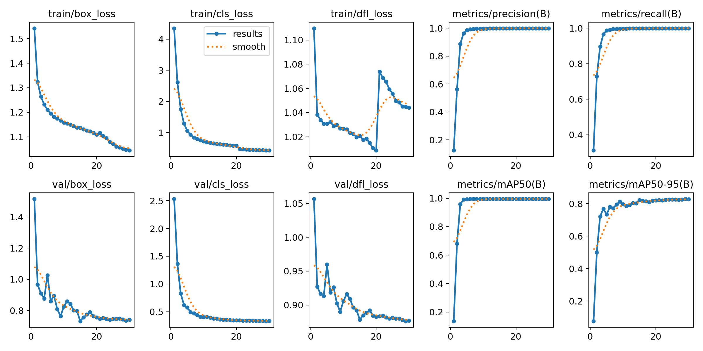
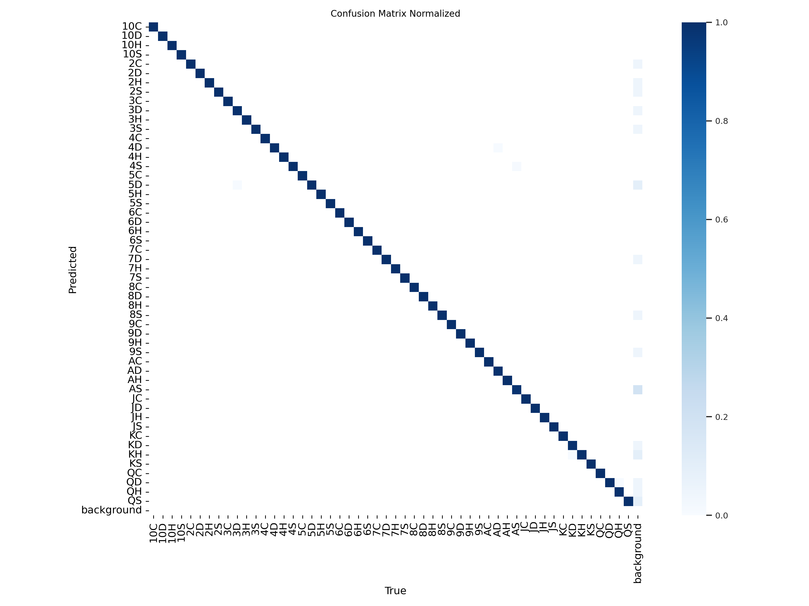

# Poker Hand Detection using YOLO11

One liner introduction to Poker Hand Detection using YOLO11 Project. features and etc.

## 1. Poker Hand Detection using YOLO11

I used a playing cards dataset from [Roboflow](https://universe.roboflow.com/augmented-startups/playing-cards-ow27d/dataset/4) and trained a YOLO11 model to detect poker hands.
I use this model to detect the cards on the table and on the player's hand.
The code for fine-tuning the model is available in the [Poker_Hand_Detection_YOLO11.ipynb](Poker_Hand_Detection_YOLO11.ipynb) notebook.

*Trained for 30 epochs in 3.78 hours on google colab's T4 GPU.*

| Class | Images | Instances | Box(P) | R    | mAP50 | mAP50-95 |
|-------|--------|-----------|--------|------|-------|----------|
| all   | 2020   | 8080      | 0.999  | 0.999 | 0.995 | 0.83     |

### Training Results

- Demo

    

- Metrics

    

- Confusion Matrix

    

## 2. Giving insights to the player about the poker hand

In this part I use the `analyze_hands.py` script to analyze the poker hands detected by the model.

### Analysis Results

    no result yet!

## Credits

By Gholamreza Dar 2024

### Resources

    - https://universe.roboflow.com/augmented-startups/playing-cards-ow27d/dataset/4